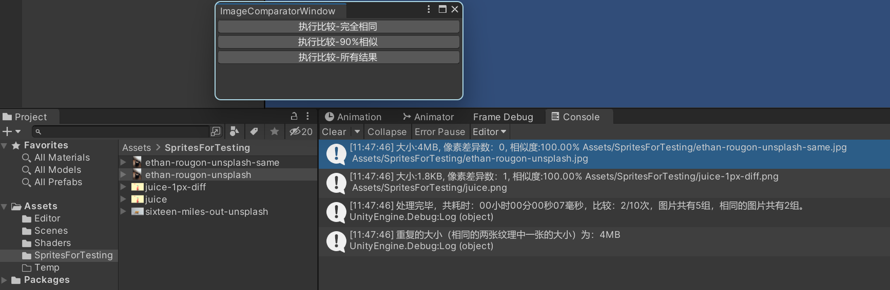

# Unity Image Comparator

Unity 2021.1.0f1

依赖 Editor Coroutine packages，其他没有 Unity 版本需求。

用 Compute Shader 来查找项目中重复的美术资源，可以调整相似的阈值，自己根据需求来改造插件。

这个是简单的实现，没有后续维护的想法（不想碰 Custom Editor 了 >_<）。

## 用法

## 项目中示例的图片

其中两张从 [Unplash](https://unsplash.com/) 中下载，像素画来自 [24 天像素画从入门到放弃](http://frankorz.com/2021/04/18/learn-pixel-art/) 。

## 博文介绍

等待补充~

## TODO

- [] 多线程

## License
This library is under the MIT License.